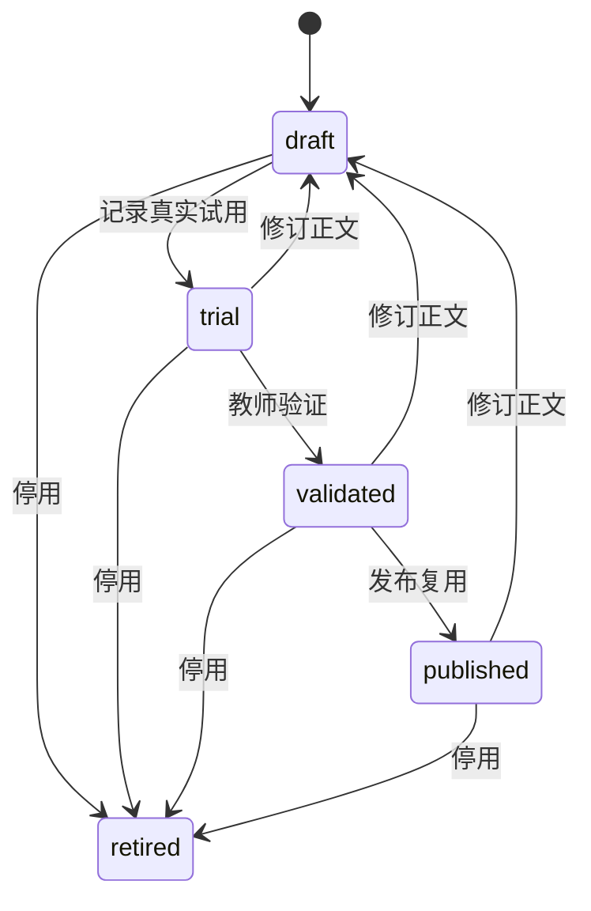

# R11 受管教学方法与成长闭环设计

## 问题

现有教学方法来自旧的自进化存储。为了阻止任意 `SKILL.md` 自修改，生产写入口已经冻结，因此桌面端只能展示旧记录。当前备课调度把已发布方法的哈希计入来源版本，却没有把方法正文交给模型，页面上的“可复用”也就不能证明后续备课真的采用了该方法。

R11 需要保留旧历史，同时提供一条教师可控、可追溯、受 Core 写入准入保护的新链路。方法内容是备课数据，不是可执行插件。

## 数据归属

Core 新增 `.edupi/memory/teaching_methods_v1.json`，作为新教学方法的唯一写入源。旧 `.edupi/evolution/evolutions.json` 继续只读，并与新记录合并到 `teaching_skill_lifecycle` 投影中。

每个受管方法保存：

- 稳定方法 ID、标题、正文、状态；
- 对象 revision 与正文 content revision；
- 创建、修订、试用、验证、发布和停用时间；
- 当前正文版本对应的真实试用记录；
- 教师反馈、关联任务和可用产物证据；
- 有界历史、请求回执和幂等记录；整个受管账本不超过 512 KiB，避免生命周期投影超过桌面桥接上限。

状态只允许按以下路径推进：

修订正文会增加 content revision 并回到草稿。旧试用保留为历史，但不能验证新正文。发布必须满足当前正文已有真实任务试用且教师明确验证通过。

## 写入边界

所有变更通过 Desktop bridge 的 `teaching-skills` operation 完成，并处于 Core Runtime writer admission 内。请求必须使用精确字段、确定性 request ID、expected revision 和受限文本。重复请求返回同一结果；旧 revision 返回冲突，不覆盖新数据。

`record_trial` 必须绑定 Core 中唯一存在的教学任务。提交的产物 ID 若存在，必须属于同一任务且文件仍可用。反馈本身作为教师证据保存；Core 不生成模拟课堂效果。

旧 evolution 写入口继续返回 `evolution_disabled`，新链路不调用旧 `EvolutionStore`，也不写项目技能文件。

## 读取与复用

生命周期投影升级为 version 2，并保持原有 kind。投影同时返回：

- 新旧教学方法及其状态、正文、试用、批准和证据；
- 由真实试用反馈派生的 teacher growth 行，包含方法、任务、正文版本、反馈和产物链接；
- 每个方法可执行动作与 revision，供桌面端避免猜测状态迁移。

只有 `published`、教师已验证且当前正文版本拥有试用证据的方法可以复用。调度继续把完整方法版本哈希计入任务来源指纹；实际 G1 Harness input 另外携带最多 3 个匹配方法的标题、版本和正文。模型提示把它们定义为教学方法参考，并仍要求只使用已给材料、不得编造学生事实。

## 桌面交互

“EduPi 能力成长”提供同页操作：新增方法、修订、选择已有任务记录试用、验证、发布、停用。每次操作成功后直接采用 Core 返回的最新投影。

“教师专业成长”除原有复盘和确认成果外，显示真实方法试用反馈。教师可以从成长记录打开关联任务；默认界面显示教师可读名称和日期，技术 ID 放在展开详情中。

## 验收

使用隔离教师数据完成：

1. 新建方法并刷新、重启后仍为草稿；
2. 绑定真实任务提交反馈，教师成长出现可追溯记录；
3. 验证并发布，方法变为可复用；
4. 后续匹配备课请求的模型输入包含该方法正文和版本；
5. 修订已发布方法后回到草稿，旧试用不能验证新版本，相关旧备课来源失效；
6. 重放请求不重复写入，旧 revision、错误任务和跨任务产物被拒绝；
7. 旧 evolution 历史仍可读，旧自修改入口仍冻结。
